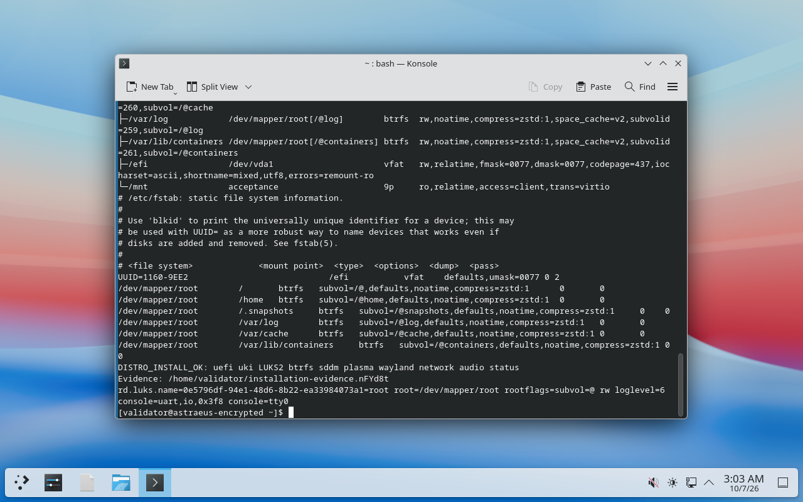

# Project Astraeus

An Arch-based desktop operating system with a reproducible image build, a Calamares
installer and a small Rust interface for inspecting the running system.

[](https://github.com/nbobby07/astraeus/actions/workflows/check.yml)

**Current milestone: Phase 2 validated.** Version `0.1.0-dev` installs to encrypted
or plain Btrfs and boots into KDE Plasma Wayland. Signed package updates now use
pre-update snapshots and verified boot confirmation. Disposable installed guests
passed successful and failed updates, plain and LUKS2 rollback, interrupted
mutation and recovery from a broken UKI. Two independent builds produced identical
ISO bytes. The [Phase 2 acceptance record](docs/phase2-integration.md) identifies
the tested source, image hashes, evidence and remaining limits.

This is a development project. The qualified target is **x86-64 UEFI under
QEMU/KVM**, using disposable disks. Physical hardware, dual boot and enforced
Secure Boot have not been qualified. There is no supported stable release or
public ISO download yet.

## What works today

- A Plasma Wayland live environment with Ghostty, Konsole, NetworkManager and the
  PipeWire audio stack.
- Calamares installation with language, timezone, keyboard, hostname, account and
  disk selection. LUKS2 encryption is recommended and optional.
- GPT partitioning, a 1 GiB EFI System Partition and six Btrfs subvolumes. Live
  accounts and installer tools are excluded from the persistent system.
- systemd-boot and an installed Unified Kernel Image, generated with mkinitcpio
  and ukify. UKI regeneration was tested through a subsequent boot.
- Unprivileged `distroctl status` and `distroctl hardware`, with text and JSON
  output. The probe reports CPU, memory, GPU, storage, firmware and virtualization
  observations; unavailable fields remain unknown.
- Signed custom packages and repository metadata, locked Arch archive inputs,
  offline Rust package builds and measured ISO reproducibility.
- Package update plans, durable transaction history, Btrfs snapshots with matching
  UKIs, and boot confirmation that checks the running state and required services.
- Explicit offline rollback through the existing live ISO, preserving all five
  persistent subvolumes. Recovery requires manual intervention; root and ESP
  changes are not atomic, and general power-loss safety is not qualified.



*The installed Plasma session after its second cold boot. The terminal shows the
 encrypted-system acceptance check completing successfully; this is a test guest.*

## Start with the source

Rust `1.96.0` and Python `3.11+` are the development baseline. The Rust toolchain
file pins the compiler and installs rustfmt and Clippy through rustup. No Python
packages are required.

```sh
git clone https://github.com/nbobby07/astraeus.git
cd astraeus
cargo fmt --all --check
cargo test --workspace --locked
cargo clippy --workspace --all-targets --locked -- -D warnings
python3 -m unittest discover -s tests -v
```

Use `python` on Windows. Linux runs the sysfs symlink fixtures; Windows exercises
portable parsing and CLI paths. Install `squashfs-tools` and `xorriso` on Linux
to run the small image reproducibility regressions. CI runs both host platforms.

Try the read-only tools without building an ISO:

```sh
cargo run --locked -p distroctl -- info --json
cargo run --locked -p distroctl -- status
cargo run --locked -p distroctl -- status --json
cargo run --locked -p distroctl -- hardware
cargo run --locked -p distroctl -- hardware --json
```

These report the host running the command. On another distribution they describe
that system; they do not turn it into Astraeus. See the [hardware and status
schema](docs/hardware.md) for field meanings and detection limits.

## Build and install

ISO construction requires a **disposable Arch Linux builder** with root, chroot,
mount and loop-device support. Use a Linux filesystem and the complete pinned
Arch snapshot. Native Windows cannot build the image. Do not switch a daily-use
machine to the project's archive mirrors.

The [build guide](docs/building.md) covers package signing, the separate installed
payload, image assembly and independent comparison builds. Its compiler comes
from the pinned Arch snapshot and differs from the developer toolchain.

| Input | Validated value |
| --- | --- |
| Arch archive | `2026/10/01` |
| ArchISO | `91-1` |
| Image build compiler | Rust `1.98.1` |
| Calamares | `3.4.3-1` |
| Project version | `0.1.0-dev` |

Follow the [installation guide](docs/installation.md) and [acceptance
procedure](docs/testing.md) for a fresh QEMU disk. Installing erases the selected
disk. The validated path uses a 32 GiB virtual disk; an 8 GiB disk was refused
before partitioning. Automated tooling launches the guests and checks their state;
acceptance also requires running the real Calamares interface.

Generated files belong in `.build/` or `out/`, which Git ignores. Build commands
refuse existing output directories so retries cannot silently reuse cached work.
Signing keys and test passwords stay outside the source tree.

## How the system fits together

```text
UEFI -> systemd-boot -> Unified Kernel Image -> initramfs
                                             -> optional LUKS2 unlock
                                             -> Btrfs -> systemd
                                                      -> SDDM -> Plasma Wayland
```

The Rust workspace contains five crates: release metadata in `distro-config`,
hardware discovery in `distro-hardware`, snapshots and recovery in
`distro-snapshots`, update coordination in `distro-transactions`, and CLI
presentation in `distroctl`.
Python standard-library scripts assemble the image and finalize the installed
system. Calamares handles partitioning, extraction and account setup through
its upstream modules. Pacman remains the package manager.

| Path | Contents |
| --- | --- |
| `crates/` | Rust libraries, CLI and fixture tests |
| `distro/branding/project.toml` | Central identity and pinned build versions |
| `distro/archiso/` | Live profile and package list |
| `distro/installed/` | Persistent packages, initramfs and UKI configuration |
| `distro/installer/` | Calamares configuration and distribution jobs |
| `distro/packages/`, `distro/repo/` | Package recipes and archive lock |
| `scripts/` | Build, provisioning and disposable VM tooling |
| `tests/` | Host regressions and guest acceptance scripts |

## Roadmap

Milestones close on recorded evidence, not a date. Later phases are planned and
have no implementation claim.

| Phase | Status | Goal |
| --- | --- | --- |
| 0 | Validated | Reproducible, signed-package Plasma live image |
| 1 | Validated | Real installer, Btrfs/LUKS2, installed UKI and hardware/status |
| 2 | Validated | Package transactions, snapshot history and boot-tested offline rollback |
| 3 | Planned | Enforced Secure Boot, signing and known-good fallback |
| 4 | Planned | Gaming stack and diagnostics across GPU families |
| 5 | Planned | Performance policies backed by measurements and restoration tests |
| 6 | Planned | Declarative state, planning, diff and adoption |

The [full roadmap](docs/roadmap.md) lists exit gates and deferred work. The recorded
install, update, break, rollback and reboot flow has passed on the qualified VM
target. Automatic fallback and enforced Secure Boot remain future work. This
development milestone does not establish a stable release.

## Documentation

- [Architecture and decisions](docs/architecture.md)
- [Building and reproducibility](docs/building.md)
- [Installation](docs/installation.md), [storage](docs/storage.md) and [boot](docs/boot.md)
- [Hardware/status schema](docs/hardware.md) and [configuration](docs/configuration.md)
- [Tests](docs/testing.md), [Phase 2 acceptance](docs/phase2-integration.md) and
  [historical Phase 1 validation](docs/validation.md)
- [Transactions](docs/transactions.md), [snapshots and recovery](docs/snapshots.md),
  and [installed-system QEMU runner](docs/phase2-validation.md)
- [Signing model](docs/security.md) and [reporting vulnerabilities](SECURITY.md)
- [Contributing](CONTRIBUTING.md) and [release procedure](docs/releases.md)

## Development

Changes go through pull requests with host checks, a clear test record and review
of the affected boundary. Installer or boot changes need disposable guest evidence
before they can be called validated. Use Conventional Commit subjects for new
commits and pull request titles; the contribution guide includes the local hooks.

Bug reports should include the source revision, firmware/VM context, reproduction
steps and redacted logs. Avoid posting passwords, signing material or identifiers
from a personal machine. Report vulnerabilities privately rather than in an issue.

The project name is temporary and lives in the branding manifest. Arch Linux,
KDE, systemd and Calamares are upstream projects with their own maintainers and
licenses; this repository does not speak for them.
